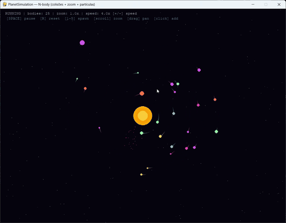

# PlanetSimulation — N-body (colisões + zoom + partículas)


Simulação de gravitação N-body em pygame. Planetas orbitam o sol, colidem, fundem-se e deixam trilhos.

## Como executar
```bash
pip install -r requirements.txt
python planet_sim.py
```

## Comandos
| Tecla | Ação |
|-------|------|
| Espaço | Pausar / Retomar |
| R | Reiniciar |
| 1–5 | Spawn de planeta a distâncias variadas |
| Scroll | Zoom (centrado no cursor) |
| Arrastar | Mover câmara |
| Clique | Spawn no cursor |
| + / − | Velocidade |

## Notas
- Integração leapfrog (KDK) para conservação de energia
- Colisões inelásticas — o maior absorve o menor
- Corpos a mais de 5000px da câmara são removidos   
